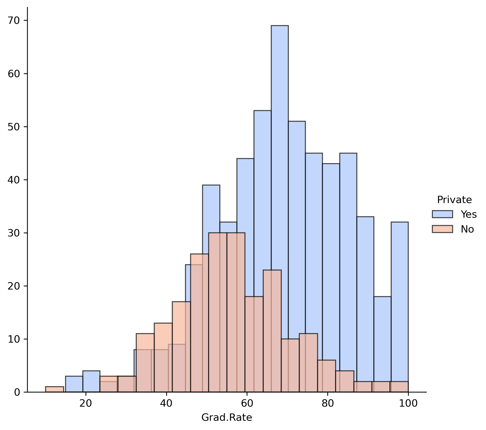
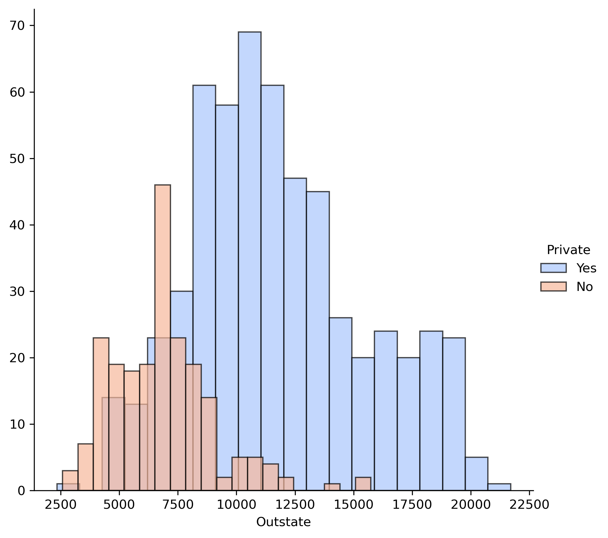
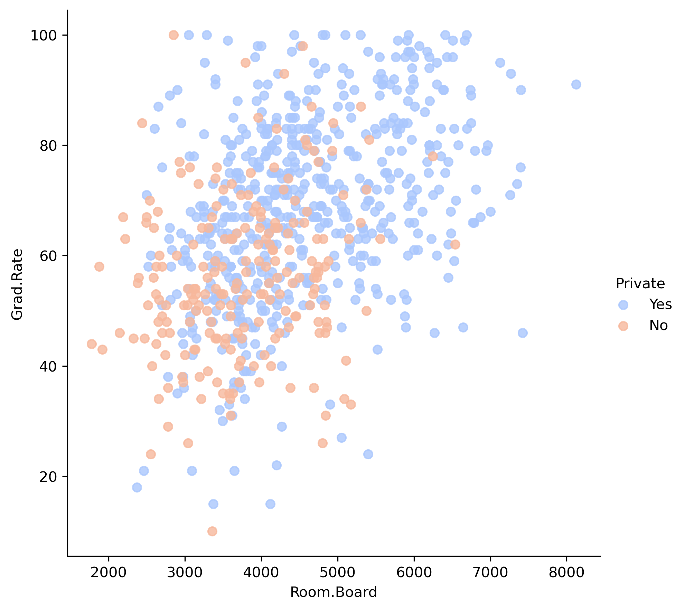
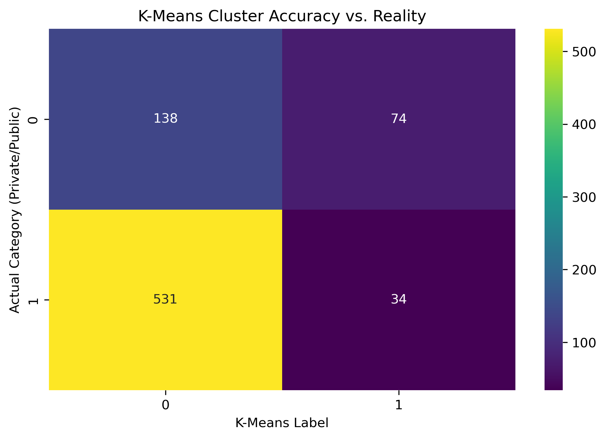

# **Unsupervised Learning: University Clustering & Data Audit**
*Applying K-Means clustering to identify institutional patterns and performing data integrity audits on academic datasets.*

---

## **Why This Project?**
In quantitative finance, Unsupervised Learning is a powerful tool for **Anomaly Detection** and **Market Segmentation**. I used this project to see if a mathematical model could successfully "discover" the difference between Public and Private universities without being given the labels—much like how a bank might use clustering to identify unusual transaction patterns or customer risk profiles.

---

## **Scientific Rigor: The Data Audit**
A key part of this project involved auditing the dataset for mathematical impossibilities—a critical step in any financial modeling workflow.

### **The "Cazenovia" Outlier**

During Exploratory Data Analysis (EDA), I identified a school (Cazenovia College) with a graduation rate of over 100%. 
* **The Fix:** I performed a data correction to cap the rate at 100%. 
* **The Insight:** This demonstrates my commitment to data integrity—ensuring the model isn't trained on "garbage" data, which is essential for risk management.

---

## **Clustering Analysis**
I used the **K-Means algorithm** to group 777 universities based on 18 variables, including Room & Board costs, Graduation Rates, and Faculty PhD percentages.

### **1. Feature Differentiation**

I analyzed **Out-of-State Tuition** as a primary separator. This plot shows a clear variance between school types, which helped the model establish distinct cluster centroids.

### **2. Model vs. Reality**

Since the dataset included labels, I was able to create a "Reality Check" comparison. This visual shows where the K-Means algorithm successfully identified the "Private" cluster based solely on the mathematical features.

---

## **Model Performance Evaluation**

To evaluate the "Unsupervised" results, I converted the labels and generated a Confusion Matrix.
* **Observation:** The model effectively identified clusters, though the overlap in the scatterplot explains why some schools are harder to categorize mathematically.

---

## **Key Takeaways for Global Markets**
* **Pattern Recognition:** Demonstrated how unsupervised models can find structural similarities in complex data without human guidance.
* **Audit Mindset:** Showcased the ability to find and fix data anomalies—an essential skill for ensuring the accuracy of financial models.
* **Quantitative Communication:** Translated raw cluster centroids into clear visual insights for a diverse audience.

---

## **How to Run**
1. Install dependencies: `pip install -r requirements.txt`
2. Run `K_Means_Clustering_Project.ipynb` in Jupyter Notebook.
